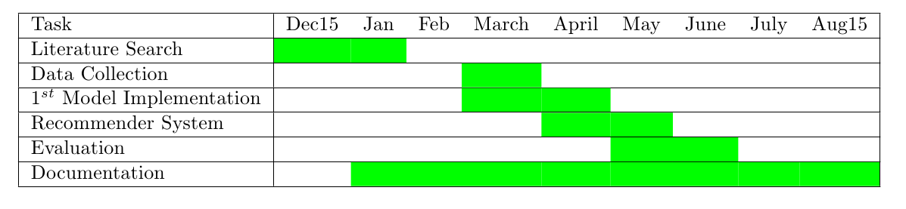

# Status

## Gantt Chart

## 9 April, 2015

### Completed

1. Understanding of the Model.
2. Recommender System Used in the Paper.
3. Proposal to improve the recommender system.
4. Initial Hardware Setup of YouBot for Demonstrations.(Using Teleop for
   Teaching the Action)

### TO DO 

1. ~~Create a permanent setup of Youbot for taking Demonstrations~~
2. ~~Automating the process of recording the demonstrations .~~
3. Coding the Recommender System 
4. ~~Coding the Model ~~
5. Understanding the Trajectory follower for YouBot and using it.
6. Understanding the Reproduction of Action part of the Paper
7. Mailing Nicholas, if he could provide his readings so that using the new
   recommender system the benchmarking can be done.

### Open Questions

1. Reprodcution of Action is not completely understood. (The idea is that the
   robot should learn to reproduce from new starting point, But this clashes
   with the paper implementation)
2. Use of Semantic based information available on the action can be used to
   replace the human experts
    - Aein, M. J., Aksoy, E. E., Tamosiunaite, M., Papon, J., Ude, A., &
      Worgotter, F. (2013). Toward a library of manipulation actions based on
      semantic object-action relations. In Intelligent Robots and Systems (IROS),
      2013 IEEE/RSJ International Conference on (pp. 4555–4562). IEEE. Retrieved from
      http://ieeexplore.ieee.org/xpls/abs_all.jsp?arnumber=6697011
3. How to evaluate the recommender ?
4. Other experiments to evaluate the model ?

## 7 May, 2015

### Completed 

1. Permanent setup for taking YouBot Demonstrations
2. Code for reading the YouBot parameters and the creating the learning model
   based on Information theory.
3. Conducted 2 experiments and reported the findings

### TO DO

1. Creation of the template library
2. Creation of recommender.

### Open questions

1. Use of simulator for making the observations. Gazebo doesnt support
velocity controller so I cannot make use of the joy pad to record the
movements in simulator
2. Evaluation with multiple starting positions without simulator or some
other approaches
3. Approaches for building the templates . so that the recommender can
be made generic to all manipulators.

## April

### Completed

1. Literature for creating library of templates based on manipulators
2. Template creation for skills
    - place
    - Align
    - Press

### TO DO

1. Implement following paper on skill based representation of tasks done by
   mobile robot manipulators in industrial environments.
     Bøgh, S., Hvilshøj, M., Kristiansen, M., & Madsen, O. (2012). Identifying
and evaluating suitable tasks for autonomous industrial mobile manipulators
(AIMM). The International Journal of Advanced Manufacturing Technology,
61(5-8), 713–726. http://doi.org/10.1007/s00170-011-3718-3

### Open Questions

1. All skills cannot be completely explained in single action (learning single
   start and single end). Example "pick" consist of 2 actions(or motion
primitives) reach and pick. Similarly "Unload"
2. So how to create templates for such skill and also recommendation for such
   skills.
3. Use of OAC's
4. Pre condition and Post condition for skill. How to learn those ?
